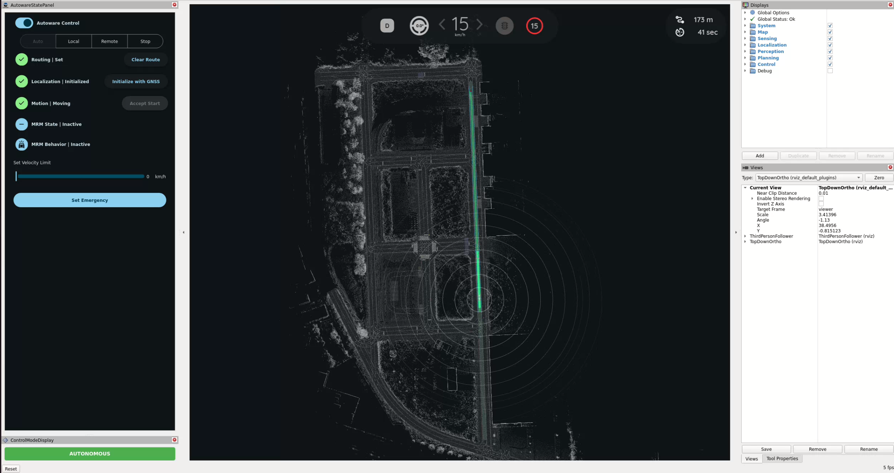
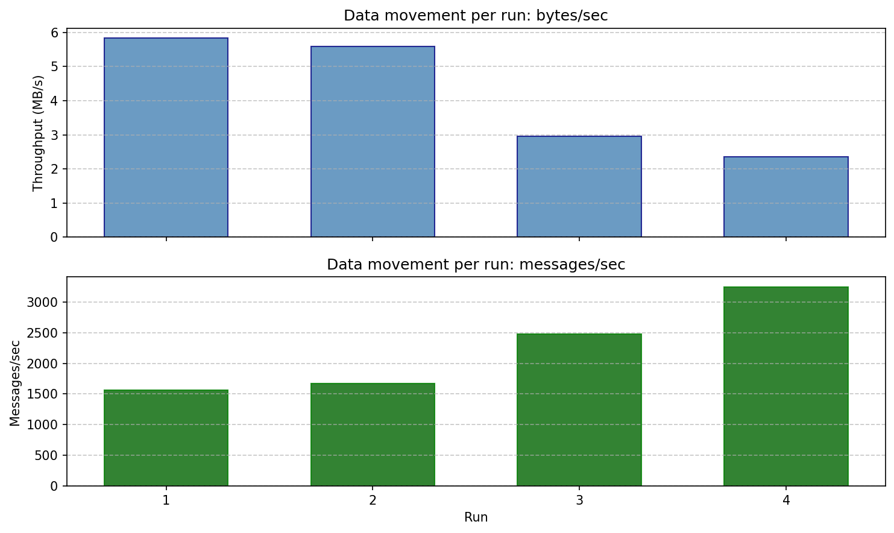
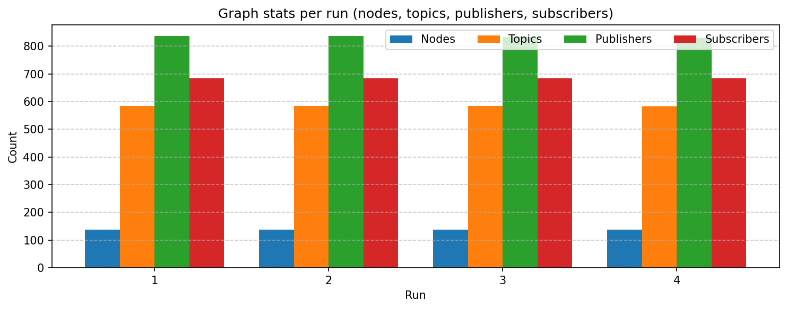
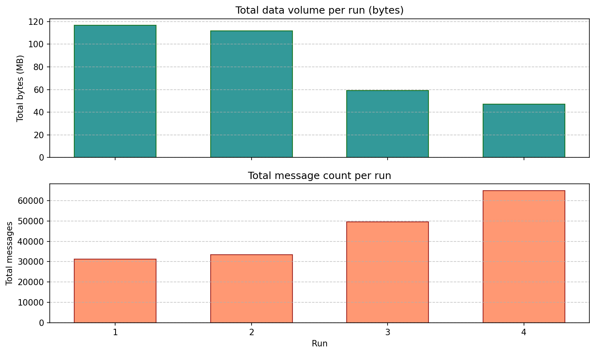

# Autoware Workspace Guide

This repository contains the Docker setup, helper scripts, and workspace notes used to build and run Autoware here.

Use this file as the main entry point.

For the exact AWSIM end-to-end setup with the patched `autoware_launch` and `autoware_universe` branches, see [README_AWSIM_E2E.md](README_AWSIM_E2E.md).

## Which Guide To Use

- Use `README.md` for the general workspace layout, Docker workflow, Autoware build flow, planning simulator, and ROS throughput scripts.
- Use [README_AWSIM_E2E.md](README_AWSIM_E2E.md) for the exact AWSIM setup, including `autoware_data`, `Shinjuku-Map`, `AWSIM-Demo`, the custom fork branches, and the validated non-CUDA launch command.

## Workspace Layout

A typical host layout is:

```text
<workspace_root>/
├── README.md
├── README_AWSIM_E2E.md
├── docker-env/
├── scripts/
├── template_graph/
├── autoware/
├── autoware_data/
├── autoware_map/
├── Shinjuku-Map/
└── AWSIM-Demo/
```

Notes:

- `autoware/` is the main Autoware workspace clone.
- `autoware_data/` is required by Autoware runtime.
- `autoware_map/` is optional and is mainly for `planning_simulator.launch.xml`.
- `Shinjuku-Map/` and `AWSIM-Demo/` are used by the AWSIM e2e flow in [README_AWSIM_E2E.md](README_AWSIM_E2E.md).

Because `docker-env/docker-compose.yaml` mounts the workspace root into the container as `/workspace`, the main container paths are:

- `/workspace/autoware`
- `/workspace/autoware_data`
- `/workspace/autoware_map`
- `/workspace/Shinjuku-Map`
- `/workspace/docker-env`

## Docker Workflow

From the host, the helper script in `docker-env/` is the preferred entry point:

```bash
cd <workspace_root>/docker-env
./start.sh --build
./start.sh --up
./start.sh --getin
```

Useful alternatives:

```bash
./start.sh --rebuild
./start.sh --down
./start.sh --status
```

If you enter the container using `./start.sh --getin`, ROS 2 and the built Autoware workspace are sourced automatically when available.

## Build Autoware

Inside the container:

```bash
apt-get update && apt-get install -y \
  python3-colcon-common-extensions \
  python3-vcstool \
  python3-rosdep
```

```bash
cd /workspace/autoware
mkdir -p src
vcs import src < repositories/autoware.repos
```

```bash
rosdep init 2>/dev/null || true
rosdep update
source /opt/ros/humble/setup.bash
rosdep install -y --from-paths src --ignore-src --rosdistro humble
```

```bash
cd /workspace/autoware
colcon build --symlink-install --cmake-args -DCMAKE_BUILD_TYPE=Release
```

If `autoware_lanelet2_extension_python` fails, use:

```bash
cd /workspace/autoware
colcon build --symlink-install --cmake-args -DCMAKE_BUILD_TYPE=Release \
  --packages-skip autoware_lanelet2_extension_python --continue-on-error
```

If you want the exact patched AWSIM build, switch the nested repos to the custom fork branches described in [README_AWSIM_E2E.md](README_AWSIM_E2E.md) before building.

## Install `autoware_data`

Run this on the host:

```bash
sudo apt-get update
sudo apt-get install -y pipx
python3 -m pipx ensurepath
```

Open a new shell or run `source ~/.bashrc`, then:

```bash
pipx install --include-deps --force "ansible==10.*"
```

```bash
cd <workspace_root>/autoware
ansible-galaxy collection install -f -r ansible-galaxy-requirements.yaml
ansible-playbook autoware.dev_env.download_artifacts \
  -e "data_dir=<workspace_root>/autoware_data" \
  --ask-become-pass
```

For the AWSIM-specific runtime layout and asset downloads, see [README_AWSIM_E2E.md](README_AWSIM_E2E.md).

## Planning Simulator

`autoware_map/` is only needed for this flow.

On the host, download the sample planning map:

```bash
mkdir -p <workspace_root>/autoware_map
gdown -O <workspace_root>/autoware_map/sample-map-planning.zip \
  'https://docs.google.com/uc?export=download&id=1499_nsbUbIeturZaDj7jhUownh5fvXHd'
unzip -d <workspace_root>/autoware_map <workspace_root>/autoware_map/sample-map-planning.zip
```

Inside the container:

```bash
cd /workspace/autoware
source install/setup.bash

ros2 launch autoware_launch planning_simulator.launch.xml \
  map_path:=/workspace/autoware_map/sample-map-planning \
  vehicle_model:=sample_vehicle \
  sensor_model:=sample_sensor_kit \
  data_path:=/workspace/autoware_data
```

If launch fails with `xacro` missing or `libgflags.so.2.2` missing, rebuild the image:

```bash
cd <workspace_root>/docker-env
./start.sh --down
./start.sh --rebuild
./start.sh --up
./start.sh --getin
```

Set the initial pose in RViz to finish initialization.

<p align="center">
  
</p>

## AWSIM E2E Quick Reference

The validated non-CUDA launch command is:

```bash
cd /workspace/autoware
source install/setup.bash

ros2 launch autoware_launch e2e_simulator.launch.xml \
  vehicle_model:=sample_vehicle \
  sensor_model:=awsim_sensor_kit \
  map_path:=/workspace/Shinjuku-Map/map \
  data_path:=/workspace/autoware_data \
  use_obstacle_segmentation_time_series_filter:=false \
  occupancy_grid_map_method:=laserscan_based \
  planning_module_preset:=ignore_traffic_lights \
  use_traffic_light_recognition:=false
```

The full end-to-end setup for this flow is documented in [README_AWSIM_E2E.md](README_AWSIM_E2E.md).

## ROS 2 Graph And Throughput Scripts

Run these from `/workspace/scripts` while Autoware is running in another terminal.

### `autoware_ros_info.py`

| Option | Description |
| --- | --- |
| `(none)` | Print nodes, topics, publishers, subscribers. |
| `--active` | Subscribe to topics with publishers and report which are active. |
| `--throughput` | Measure bytes/sec, msg/sec, and avg bytes/message per topic. |
| `--sample-sec N` | Sampling duration in seconds. Default: `5`. |
| `--runs N` | Number of runs when used with `--csv`. |
| `--csv PREFIX` | Write `PREFIX_summary.csv` and `PREFIX_throughput_detail.csv`. |

Example:

```bash
cd /workspace/scripts
python3 autoware_ros_info.py --csv report --sample-sec 10 --runs 5
```

### `plot_ros_data_movement.py`

| Option | Description |
| --- | --- |
| `--summary PATH` | Summary CSV. Default: `report_summary.csv`. |
| `--detail PATH` | Detail CSV. Optional. |
| `--out DIR` | Output directory for PNGs. |
| `--top-n N` | Number of top topics to plot. Default: `15`. |

Example:

```bash
cd /workspace/scripts
python3 plot_ros_data_movement.py \
  --summary report_summary.csv \
  --detail report_throughput_detail.csv \
  --out ./plots
```

If needed:

```bash
pip install matplotlib numpy
```

<p align="center">
  
</p>
<p align="center">
  
</p>
<p align="center">
  
</p>

## Notes

- Do not commit `install/`, `build/`, or `log/`.
- The outer repository intentionally ignores the nested `autoware/` workspace.
- The main code changes for the AWSIM workaround live in nested source repos such as `src/launcher/autoware_launch` and `src/universe/autoware_universe`.
